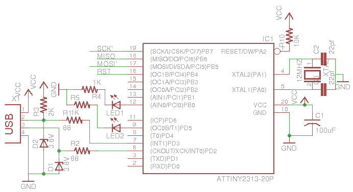

[![LinkedIn][linkedin-shield]][linkedin-url]

<!-- PROJECT LOGO -->
<br />
<p align="center">
  <a href="https://github.com/borko-rajkovic/8bit-gmail-notifier">
    
  </a>

  <h3 align="center">8bit Gmail Notifier</h3>

  <p align="center">
    Breadboard Gmail notifier written in Assembly
    <br />
    <a href="https://github.com/borko-rajkovic/8bit-gmail-notifier/issues">Report Bug</a>
    ·
    <a href="https://github.com/borko-rajkovic/8bit-gmail-notifier/issues">Request Feature</a>
  </p>
</p>

<!-- TABLE OF CONTENTS -->

## Table of Contents

- [Demo](#demo)
- [Features](#features)
- [About the Project](#about-the-project)
  - [Built With](#built-with)
  - [Schematics](#schematics)
    - [Complete breadboard](#complete-breadboard)
    - [USBtinyISP Programmer](#usbtinyisp-programmer)
    - [BOM (Bill of materials)](#bom-bill-of-materials)
- [Getting Started](#getting-started)
  - [Pre-requisites](#pre-requisites)
  - [Set up project](#set-up-project)
  - [Connect to AVR](#connect-to-avr)
  - [Reading AVR memory and fuses](#reading-avr-memory-and-fuses)
  - [Writing fuses](#writing-fuses)
  - [Writing flash and EEPROM memory](#writing-flash-and-eeprom-memory)
- [Contributing](#contributing)
- [Contact](#contact)

<!-- DEMO -->

## Demo

Watch device in live action [here](https://youtu.be/EqjDfDrvmFI)

## Features

- Buzzer play melody on new mail
- 7-segment display of unread email count (animated)
- LCD display newest email sender and subject
- EEPROM data storage in case of power loss


<!-- ABOUT THE PROJECT -->

## About The Project

You always wanted to learn microcontroller programming in Assembly building something useful?


With this project you can learn the basic concepts of AVR MCU programming in Assembly, such as

- Using shift-register for 7-segment display
- Animating digit using Timer/Counter
- Writing to LCD display
- Making tones and melodies with PWM
- Read/Write to EEPROM
- Connecting to PC with UART

### Built With

Assembly - Atmel Studio 7.0


### Schematics

#### Complete breadboard

This breadboard includes home made USBtinyISP programmer. If you have your own, you can skip that part.

[![8bit-gmail-notifier][product-screenshot]](https://github.com/borko-rajkovic/8bit-gmail-notifier)

#### USBtinyISP Programmer

As can be seen on breadboard diagram, USBtinyISP Programmer is surrounded by dashed red line. If you wish to build it yourself, here is the schema for it



#### BOM (Bill of materials)

Following is the bill of materials needed for this project (not including parts for USBtinyISP programmer)

<table>
  <thead>
    <tr>
    <th>Amount</th>
    <th>Part Type</th>
    </tr>
  </thead>
  <tbody>
<tr>
    <td>2</td>
    <td>Breadboard</td>
</tr><tr>
    <td>1</td>
    <td>74HC164</td>
</tr><tr>
    <td>1</td>
    <td>7-Segment LED Display</td>
</tr><tr>
    <td>1</td>
    <td>ATmega16</td>
</tr><tr>
    <td>1</td>
    <td>FTDI Basic Programmer</td>
</tr><tr>
    <td>1</td>
    <td>Trimmer Potentiometer</td>
</tr><tr>
    <td>1</td>
    <td>330Ω Resistor</td>
</tr><tr>
    <td>1</td>
    <td>Buzzer 12mm</td>
</tr><tr>
    <td>1</td>
    <td>LCD-16X2</td>
</tr>
  </tbody>
</table>

Complete BOM list including parts for USBtinyISP programmer can be found [here](./Documentation/Fritzing/8bit-gmail-notifier-bom.html)

<!-- GETTING STARTED -->

## Getting Started

### Pre-requisites

- [Atmel Studio](https://www.microchip.com/mplab/avr-support/atmel-studio-7)
- [WinAVR](http://winavr.sourceforge.net/)
- [8bit-gmail-notifier-csharp-uart](https://github.com/borko-rajkovic/8bit-gmail-notifier-csharp-uart)

### Set up project

To get a local copy of the project up and running, simply

```sh
git clone https://github.com/borko-rajkovic/8bit-gmail-notifier
```

Atmel Studio project is in directory **8bit-gmail-notifier**

Once you open project, in Solution explorer (`Ctrl + Alt + L`) right click on project name, then on Properties and make sure all is selected as shown here


### Connect to AVR

Make sure you installed WinAVR, connect USBtinyISP programmer to your PC and run

```
avrdude -c usbtiny -p m16
```

You should get something like this

```
avrdude: AVR device initialized and ready to accept instructions

Reading | ################################################## | 100% 0.02s

avrdude: Device signature = 0x1e9403

avrdude: safemode: Fuses OK

avrdude done.  Thank you.
```

### Reading AVR memory and fuses

To read memory and fuses from AVR simply run

```
avrdude -c usbtiny -p m16 -U flash:r:flash.hex:i -U lfuse:r:low_fuse_val.hex:i -U hfuse:r:high_fuse_val.hex:i
```

It will write flash memory to `flash.hex`, low fuse to `low_fuse_val` and high fuse to `high_fuse_val.hex`

Output should look like this

```
avrdude: AVR device initialized and ready to accept instructions

Reading | ################################################## | 100% 0.02s

avrdude: Device signature = 0x1e9403
avrdude: reading flash memory:

Reading | ################################################## | 100% 16.81s


avrdude: writing output file "flash.hex"
avrdude: reading lfuse memory:

Reading | ################################################## | 100% 0.01s

avrdude: writing output file "low_fuse_val.hex"
avrdude: reading hfuse memory:

Reading | ################################################## | 100% 0.01s

avrdude: writing output file "high_fuse_val.hex"

avrdude: safemode: Fuses OK

avrdude done.  Thank you.

```

### Writing fuses

You should set up fuses for your chip in following way

- hifh fuse values from [this](./Documentation/Atmega16_fuses/high_fuse_val.hex) file
- low fuse values from [this](./Documentation/Atmega16_fuses/low_fuse_val.hex) file


Command to set fuses is

```
avrdude -c usbtiny -p m16 -U lfuse:w:low_fuse_val.hex:i -U hfuse:w:high_fuse_val.hex:i
```

Output should be similar to writing flash or EEPROM memory, check bellow

### Writing flash and EEPROM memory

Once you run build, in Debug folder there will be two files

- `8bit-gmail-notifier.hex` - flash memory
- `8bit-gmail-notifier.eep` - EEPROM memory

In order to write to flash memory you should run

```
avrdude -c usbtiny -p m16 -U flash:w:8bit-gmail-notifier.hex:i
```

Output should look something like this

```
avrdude: AVR device initialized and ready to accept instructions

Reading | ################################################## | 100% 0.02s

avrdude: Device signature = 0x1e9403
avrdude: NOTE: FLASH memory has been specified, an erase cycle will be performed
         To disable this feature, specify the -D option.
avrdude: erasing chip
avrdude: reading input file "8bit-gmail-notifier.hex"
avrdude: writing flash (1560 bytes):

Writing | ################################################## | 100% 2.56s


avrdude: 1560 bytes of flash written
avrdude: verifying flash memory against 8bit-gmail-notifier.hex:
avrdude: load data flash data from input file 8bit-gmail-notifier.hex:
avrdude: input file 8bit-gmail-notifier.hex contains 1560 bytes
avrdude: reading on-chip flash data:

Reading | ################################################## | 100% 1.64s


avrdude: verifying ...
avrdude: 1560 bytes of flash verified

avrdude: safemode: Fuses OK

avrdude done.  Thank you.

```

Similar to this, writing to EEPROM should be done with this command

```
avrdude -c usbtiny -p m16 -U eeprom:w:8bit-gmail-notifier.eep:i
```

<!-- CONTRIBUTING -->

## Contributing

Contributions are what make the open source community such an amazing place to learn, inspire, and create. Any contributions you make are **greatly appreciated**.

1. Fork the Project
2. Create your Feature Branch (`git checkout -b feature/AmazingFeature`)
3. Commit your Changes (`git commit -m 'Add some AmazingFeature`)
4. Push to the Branch (`git push origin feature/AmazingFeature`)
5. Open a Pull Request

<!-- CONTACT -->

## Contact

Borko Rajkovic - [LinkedIn](https://linkedin.com/in/borko-rajkovic) - rajkovicborko@gmail.com

<!-- MARKDOWN LINKS & IMAGES -->

[linkedin-shield]: https://img.shields.io/badge/-LinkedIn-black.svg?style=flat-square&logo=linkedin&colorB=555
[linkedin-url]: https://linkedin.com/in/borko-rajkovic/
[product-screenshot]: ./Documentation/Fritzing/8bit-gmail-notifier_bb.png
